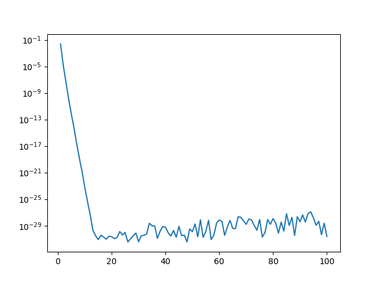
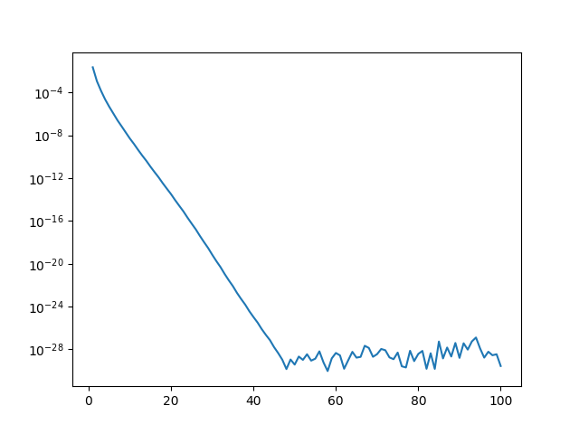

# FISES-Simulacio
Treball de Simulació de Física Estadística

## Plots
Aquí podem veure els diferents plots que hem pogut fer:

## Enllaços interessants
[NumPy for Matlab users](https://docs.scipy.org/doc/numpy/user/numpy-for-matlab-users.html)
